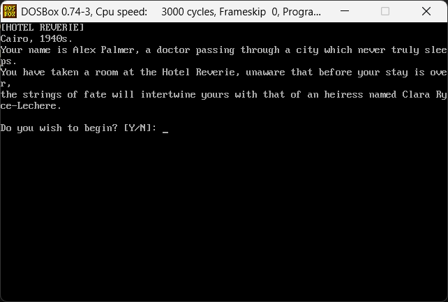
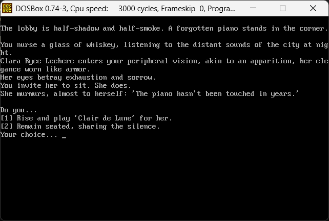

# Hotel Reverie

A short text-based adventure/interactive fiction console game inspired by the Black Mirror episode Hotel Reverie.
As a non-commercial fan game, it was created as a learning experience, with all rights belonging to the original creators and no profit being made.

## Screenshots

## How To Run

You will need an MS-DOS emulator to run this game.
DOSBox can be downloaded [here](https://www.dosbox.com/).